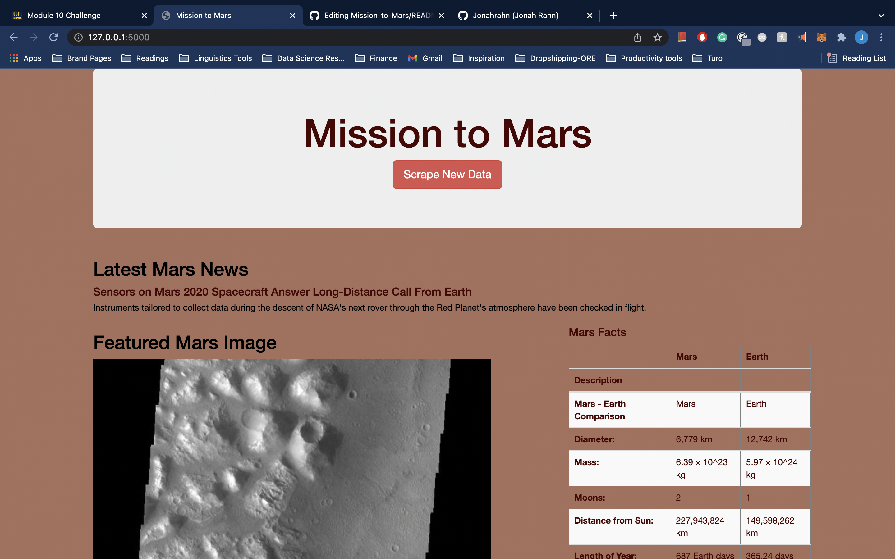
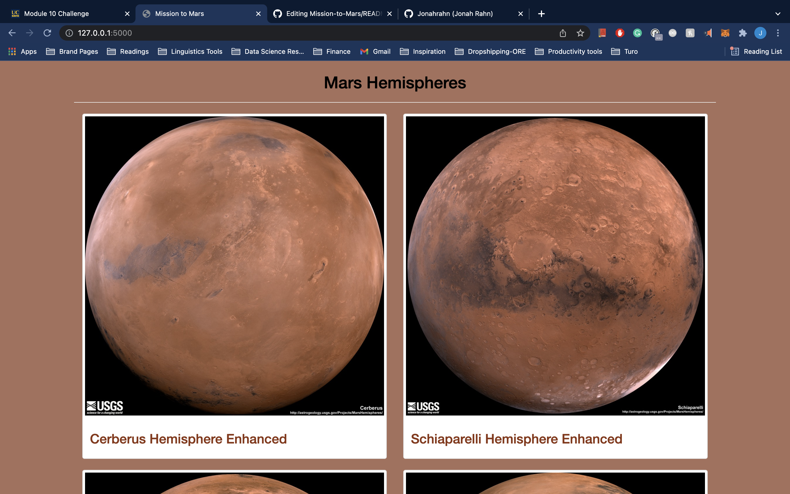

# Mission-to-Mars
Web-scraping project of Mars

## Resources
- app.py
- scrpaing.py
- templates/index.html
- Mission_to_Mars_Challenge.ipynb
--------------
- Python
- Jupyter Notebook
- BeautifulSoup
- Flask
- MongoDB
- Splinter

## Overview of the analysis:
This project is a demonstration in to using Python, Splinter, Flask, Mongo and Beautiful Soup; to create a webpage that stores all of the collected scraped data from multiple sites. The button on the front page uses BeautifulSoup and Splinter to scrape full-resolution images of Mars’s hemispheres and the titles of those images, stores the scraped data on a Mongo database, uses a web application to display the data, and alters the design of the web app to accommodate all of te data we have scraped.  

## Results:
- Scrape Full-Resolution Mars Hemisphere Images and Titles
- Update the Web App with Mars Hemisphere Images and Titles
- Add Bootstrap 3 components to change the design

- Here we see the frontpage of the web app which shows the desing elements added

- Here we see the images that have been scraped to be displayed in the flask app

## Summary:
In the app.py, we setup the flask, mongo and the app routes to scrape the images and titles. First off the websraping file scraping.py is called to scrape all of the images and added to a dictionary. Once the images and titles have been stored, we can upload them to the flask app to be displayed via index.html. In the final part of the project, I decided to modify the color sheme of some of the elements of the page to make match the scraped images.
